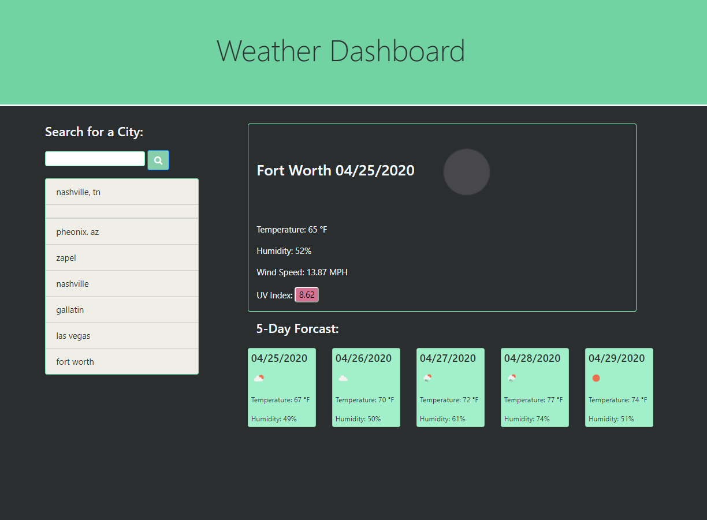

# Weather-Dashboard
Weather app that can be utilized to search the current weather and 5 day forecast of a CITY.

## User Story
As a traveler <br>
I want to see the weather outlook for multiple cities <br>
so that I can plan a trip accordingly


## Future Changes
* Add in Geolocation

* Fix the search to allow city and state, not just city name


## Preview



# Technologies Used
* HTML
* CSS
* Bootstrp - CSS framework
* Font Awesome
* Javascript
* jQuery

# Server-Side API
* [OpenWeather API](https://openweathermap.org/api)

# Author
Linsay McMahon - [Github](https://github.com/McMahon8900)

Link to deployed site - [https://mcmahon8900.github.io/Weather-Dashboard/](https://mcmahon8900.github.io/Weather-Dashboard/)


<br>
<br

<hr>


# Unit 06 Server-Side APIs Homework: Weather Dashboard

Developers are often tasked with retrieving data from another application's API and using it in the context of their own. Third-party APIs allow developers to access their data and functionality by making requests with specific parameters to a URL. In this homework assignment, your challenge is to build a weather dashboard using the OpenWeather API.


## Instructions

Build a weather dashboard application with search functionality to find current weather conditions and the future weather outlook for multiple cities. Following the [common templates for user stories](https://en.wikipedia.org/wiki/User_story#Common_templates), we can frame this challenge as follows:

```
As a traveler
I want to see the weather outlook for multiple cities
so that I can plan a trip accordingly
```

How do you deliver this? Here are some guidelines:

* Use the [OpenWeather API](https://openweathermap.org/api) to retrieve weather data for cities. The documentation includes a section called "How to start" that will provide basic setup and usage instructions.

* Use AJAX to hook into the API to retrieve data in JSON format.

* Your app will run in the browser and feature dynamically updated HTML and CSS powered by jQuery.

* Display the following under current weather conditions:

  * City

  * Date

  * Icon image (visual representation of weather conditions)

  * Temperature

  * Humidity

  * Wind speed

  * UV index

* Include a search history so that users can access their past search terms. Clicking on the city name should perform a new search that returns current and future conditions for that city. 

* Include a 5-Day Forecast below the current weather conditions. Each day for the 5-Day Forecast should display the following:

  * Date

  * Icon image (visual representation of weather conditions)

  * Temperature

  * Humidity

### Hints

* Create multiple functions within your application to handle the different parts of the dashboard:

  * Current conditions
  
  * 5-Day Forecast
  
  * Search history

  * UV index

* You will need to make more than one AJAX call.

* You will need to hardcode some of the parameters in the API's URL. User input will determine some of the other parameters.

* Use `localStorage` to store any persistent data.


## Minimum Requirements

* Functional, deployed application.

* GitHub repository with a unique name and a README describing the project.

* User can search for weather reports by city using the openweathermap API.

* After searching for a city, the following information is displayed:

  *  Current temperature

  *  Current humidity

  *  Windspeed

  *  Uv index

  *  5 day forecast

* Application uses icons to represent weather conditions.

* Application stores previously searched for cities in localstorage and displays them to the user.

* Application loads last searched city forecast on page load.

## Bonus

* Use the [Geolocation API](https://developer.mozilla.org/en-US/docs/Web/API/Geolocation_API) to add the user's current location to the initial landing page.

* Add the application to your portfolio.